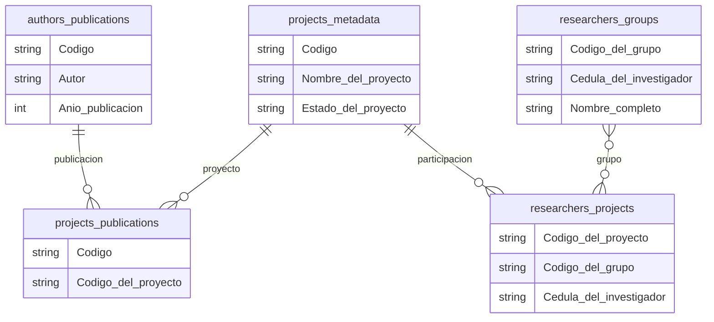
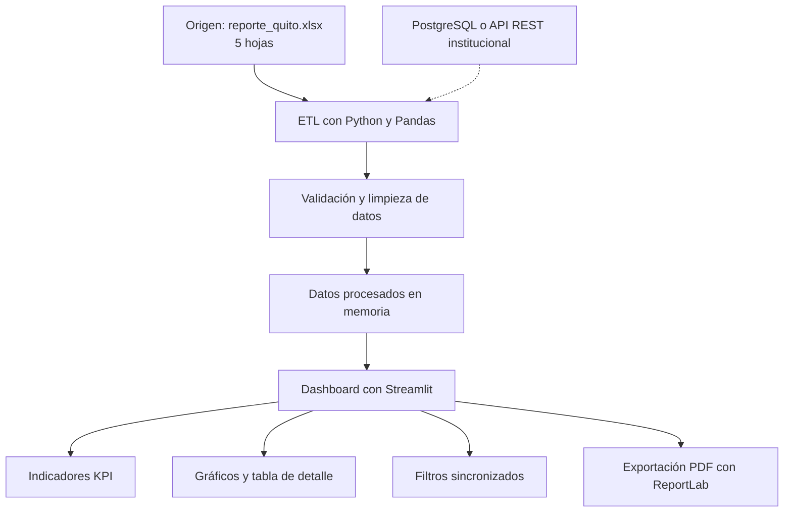

# 02. Diseño de la solución

## 1. Modelo de datos

## 2. Arquitectura de la solución

### 2.2. Descripción de los componentes

| Componente | Función |
|---|---|
| Excel | Fuente inicial de publicaciones, proyectos, investigadores y grupos. |
| Python y Pandas | Cargar, validar y transformar los datos. |
| Almacenamiento | Mantener los datos procesados en memoria para el prototipo. |
| Streamlit | Presentar el dashboard interactivo con indicadores, filtros y gráficos. |
| ReportLab | Generar reportes PDF con los resultados filtrados. |

### 2.3. Escalabilidad de la solución

Para el prototipo se utilizará el archivo Excel como fuente
de información y Pandas para el procesamiento.

En un entorno de producción, el origen podría sustituirse
por una base de datos PostgreSQL o una API REST institucional.

Se mantendría una capa ETL independiente para validar y
normalizar la información, sin modificar la lógica principal
del dashboard.

Para mayores volúmenes de datos se podría incorporar
almacenamiento persistente, consultas optimizadas,
actualizaciones programadas y mecanismos de autenticación.

## 3. Filtros del dashboard

### 3.1. Filtros propuestos

| Filtro | Fuente de datos | Justificación |
|---|---|---|
| Año de publicación | `authors_publications` | Permite analizar la evolución de la producción científica por período. |
| Grupo de investigación | `authors_publications` y `researchers_groups` | Permite consultar la producción asociada a cada grupo y apoyar el seguimiento institucional. |
| Tipo de publicación | `authors_publications` | Facilita comparar artículos y otras categorías de producción científica. |

### 3.2. Comportamiento de los filtros

Los filtros se aplicarán de forma sincronizada a los KPI,
gráficos y tablas de detalle.

El reporte PDF conservará los filtros seleccionados
y presentará los resultados correspondientes.

Se evitarán uniones entre hojas cuando los códigos
no tengan correspondencias verificadas, para prevenir
conteos duplicados o resultados incorrectos.

## 4. Decisiones técnicas

Se seleccionó Python como lenguaje principal por su capacidad
para procesar y analizar datos. Pandas permitirá realizar
la extracción, validación y transformación de las cinco hojas
del archivo Excel. Streamlit se utilizará para desarrollar
un dashboard web interactivo, mientras que Plotly facilitará
la creación de gráficos y ReportLab permitirá exportar
reportes PDF. Esta combinación permite construir un prototipo
funcional en poco tiempo y mantener separados los componentes
de procesamiento, visualización y exportación.

Como alternativa se consideró Power BI, que ofrece herramientas
avanzadas de visualización y análisis. Sin embargo, se eligió
Streamlit porque permite desarrollar una solución completamente
en Python, personalizar la exportación PDF e integrar directamente
el procesamiento de los datos.

La IA se utilizó como apoyo para estructurar el modelo de datos,
proponer la arquitectura y comparar alternativas tecnológicas.
Se ajustó la propuesta inicial para mantener los nombres
originales de las hojas y evitar asumir relaciones entre códigos
que no presentan correspondencias suficientes. Las decisiones
se contrastaron con el análisis exploratorio realizado en Python.